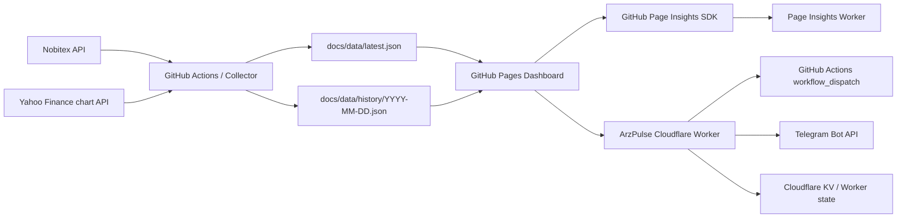

<div align="center">

# ✨ ArzPulse

### Real-time Market Intelligence for Crypto, Gold, Oil & Global Markets

A high-signal market terminal for the Iranian market — combining Nobitex local-market data, global market snapshots, historical charts, automated GitHub data updates, Telegram reporting, Cloudflare Workers, and GitHub Page Insights analytics in one GitHub Pages project.

<p>
  <a href="https://mehrdadmb2.github.io/ArzPulse/">🌐 Live Dashboard</a> ·
  <a href="https://github.com/mehrdadmb2/ArzPulse">💻 Repository</a> ·
  <a href="https://github.com/mehrdadmb2/ArzPulse/issues">🐛 Issues</a> ·
  <a href="https://github.com/mehrdadmb2/github-page-insights">📊 Page Insights</a>
</p>

[](https://mehrdadmb2.github.io/ArzPulse/)
[](https://github.com/mehrdadmb2/ArzPulse/actions/workflows/update-prices.yml)
[](https://github.com/mehrdadmb2/ArzPulse/actions/workflows/keep-alive.yml)
[](https://github.com/mehrdadmb2/ArzPulse/blob/main/LICENSE)
[](https://github.com/mehrdadmb2/ArzPulse/stargazers)
[](https://github.com/mehrdadmb2/ArzPulse/commits/main/)
[](https://github.com/mehrdadmb2/github-page-insights)

</div>

---

## 📡 Live Market Board

The badges below read the latest public ArzPulse JSON snapshot dynamically. They are designed to refresh independently of the README text, so the values shown on GitHub can change as `docs/data/latest.json` changes.

> **Important:** the values are the latest stored ArzPulse snapshot, not a guaranteed tick-by-tick exchange feed. Global market quotes may be delayed according to the upstream source and the collector configuration.

### 🇮🇷 Local / Nobitex

| Asset | Live price | Scope |
|---|---|---|
| 🟠 Bitcoin | [](https://mehrdadmb2.github.io/ArzPulse/) | BTC / IRR |
| 🟣 Ethereum | [](https://mehrdadmb2.github.io/ArzPulse/) | ETH / IRR |
| 🟢 Tether | [](https://mehrdadmb2.github.io/ArzPulse/) | USDT / IRR |
| 🟣 Notcoin | [](https://mehrdadmb2.github.io/ArzPulse/) | NOT / IRR |
| 🟡 18K Gold | [](https://mehrdadmb2.github.io/ArzPulse/) | Calculated from XAUT + USDT |
| 💵 Dollar reference | [](https://mehrdadmb2.github.io/ArzPulse/) | USDT / IRR reference |

### 🌍 Global Market Snapshot

| Market | Latest snapshot | Unit / contract |
|---|---|---|
| 🛢️ Brent Crude | [](https://mehrdadmb2.github.io/ArzPulse/) | BZ=F |
| 🛢️ WTI Crude | [](https://mehrdadmb2.github.io/ArzPulse/) | CL=F |
| 🥇 Gold | [](https://mehrdadmb2.github.io/ArzPulse/) | GC=F |
| ⚪ Silver | [](https://mehrdadmb2.github.io/ArzPulse/) | SI=F |
| 📈 S&amp;P 500 | [](https://mehrdadmb2.github.io/ArzPulse/) | ^GSPC |
| 📊 Nasdaq Composite | [](https://mehrdadmb2.github.io/ArzPulse/) | ^IXIC |
| 💲 Dollar Index | [](https://mehrdadmb2.github.io/ArzPulse/) | DX-Y.NYB |

> **Live source file:** [`docs/data/latest.json`](https://github.com/mehrdadmb2/ArzPulse/blob/main/docs/data/latest.json) · **Raw:** [`latest.json`](https://mehrdadmb2.github.io/ArzPulse/data/latest.json)

---

## 🌌 What is ArzPulse?

**ArzPulse** is a GitHub Pages market terminal built around a generated JSON data layer. The project focuses on a dense, visual, responsive market-monitoring experience rather than a static landing page.

The current dashboard combines:

- ₿ Crypto market tracking
- 🥇 18K gold monitoring
- 💵 USDT / IRR dollar reference
- 🛢️ Brent and WTI crude oil
- 🥇 XAU/USD gold
- ⚪ Silver
- 📈 S&amp;P 500
- 📊 Nasdaq Composite
- 💲 DXY
- 📉 Historical charts and relative performance
- 🧭 Market Status / breadth / momentum / volatility / data health
- ⭐ Watchlist
- 🌌 Interactive ArzPulse Galaxy / PULSE visual
- 🌐 English-first UI with Persian / RTL mode
- 📊 GitHub Page Insights traffic analytics
- 🤖 Telegram bot support
- ☁️ Cloudflare Worker automation
- ⚙️ GitHub Actions data collection

The repository currently uses GitHub Pages from `docs/`, JSON snapshots in `docs/data/`, a Node-based collector, GitHub Actions automation, and a Cloudflare Worker for scheduled workflow dispatching. citeturn466338view1

---

## ✨ Core Features

### 🌐 Market Terminal

- Interactive price cards for local and global assets
- Last price, daily change, high, low, volume, best buy, best sell and spread where the source provides them
- Asset-specific colors and visual identity
- Responsive glassmorphism dashboard
- Deep shadows, glow, hover elevation and pointer interactions
- Animated ambient background
- Live market ticker
- Fast overview tiles with mini charts
- Market filters for all / crypto / commodities / indices
- IRR ↔ USD display controls where supported
- Comfortable ↔ Compact density mode
- Dark ↔ Light theme
- English ↔ Persian language switch

### 📊 Market Status

The dashboard includes a dedicated **Market Status** section with calculated indicators from the available asset changes and data state:

- Pulse Score
- Market Breadth
- Up / Down count
- Momentum
- Average change
- Volatility indicator
- Largest daily move
- Data health
- Freshness
- Source count
- Error count
- Top movers
- Iran / London / New York session view

### 📈 Historical Analytics

- 1-day, 7-day and 30-day ranges
- SVG-based resilient chart rendering on the current dashboard
- Historical series generated from daily JSON snapshots
- Local assets and global assets supported by the data model
- Relative Performance comparison across tracked assets
- Asset-specific chart colors
- Data fallback behavior when a historical snapshot is missing

### ⭐ Watchlist & Details

- Add/remove assets from a personal watchlist in the browser
- Detailed asset panel
- Source and freshness metadata
- Key market statistics
- Deep-linkable dashboard sections

### 📊 Website Analytics

ArzPulse includes the browser SDK and dashboard widget from the [`github-page-insights`](https://github.com/mehrdadmb2/github-page-insights) project.

The integrated widget is configured for:

- Platform ID: `arzpulse`
- Analytics Worker: `https://github-page-insights-worker.game-developer-mb.workers.dev`
- Recent views
- Unique visitors
- Sessions
- Average visit duration
- All-time totals when available
- 7-day traffic trend
- Top countries
- Device mix
- Analytics refresh control
- Local cached fallback when the analytics endpoint is temporarily unavailable

The integration lives under `docs/assets/page-insights*.js` and `docs/assets/page-insights*.css` so the analytics UI remains a self-contained part of the dashboard.

---

## 🤖 Telegram Bot

The Worker-side bot code supports the current command set documented in the project implementation:

| Command | Purpose |
|---|---|
| `/start` | Welcome message and command overview |
| `/help` | Full bot guide |
| `/prices` | Current prices for supported local assets |
| `/gold` | 18K gold price |
| `/dollar` | Dollar / USDT reference |
| `/btc` | Bitcoin details |
| `/eth` | Ethereum details |
| `/usdt` | Tether details |
| `/not` | Notcoin details |
| `/chart` | Chart command guide |
| `/chart BTC 24h` | 24-hour Bitcoin chart |
| `/chart ETH 7d` | 7-day Ethereum chart |
| `/chart NOT 30d` | 30-day Notcoin chart |
| `/chartall` | Separate charts for the supported crypto set |
| `/status` | Data freshness / update status |
| `/setchannel` | Configure automatic channel/group updates |
| `/stopchannel` | Stop automatic channel/group updates |

The bot uses HTML-formatted Telegram messages and QuickChart for generated chart images in its current implementation. fileciteturn0file0L97-L212 fileciteturn0file0L365-L455

---

## 🧱 Architecture



### Data flow

1. The collector fetches local market statistics from Nobitex.
2. The collector fetches the configured global market symbols from Yahoo Finance.
3. Gold 18K is derived from XAUT/USDT and the USDT/IRR reference.
4. The current snapshot is written to `docs/data/latest.json`.
5. A daily historical array is maintained under `docs/data/history/`.
6. GitHub Pages reads those generated JSON files directly in the browser.
7. The Cloudflare Worker can dispatch the GitHub workflow on its 5-minute Cron Trigger.
8. The website sends anonymous pageview telemetry to the Page Insights Worker and can read aggregate analytics for the dashboard. citeturn466338view1

---

## 🧮 18K Gold Calculation

ArzPulse derives the 18K gold price per gram from the XAUT and USDT market data collected from Nobitex.

```text
XAUT/USDT × USDT/IRR
        ↓
price per troy ounce in IRR
        ↓
÷ 31.1034768
        ↓
× 0.75
        ↓
18K gold price per gram in IRR
```

Where:

- `31.1034768` = grams in one troy ounce
- `0.75` = 18K purity factor (`18 / 24`)

This matches the calculation implemented by `scripts/fetch-and-save.js`.

---

## 🗂️ Project Structure

```text
ArzPulse/
├── .github/
│   └── workflows/
│       ├── update-prices.yml
│       └── keep-alive.yml
│
├── docs/
│   ├── index.html
│   ├── assets/
│   │   ├── app.css
│   │   ├── app.js
│   │   ├── config.js
│   │   ├── page-insights.js
│   │   ├── page-insights-widget.js
│   │   └── page-insights-widget.css
│   └── data/
│       ├── latest.json
│       ├── meta.json
│       └── history/
│           └── YYYY-MM-DD.json
│
├── scripts/
│   └── fetch-and-save.js
│
├── worker/
│   ├── index.js
│   ├── wrangler.toml
│   ├── README.md
│   ├── schema.sql
│   └── migrations/
│       └── 0001_profiles.sql
│
├── tools/
│   └── apply-insights-integration.ps1
│
├── LICENSE
└── README.md
```

---

## 🧰 Technology Stack

| Layer | Technology |
|---|---|
| Dashboard | HTML5 + CSS3 + Vanilla JavaScript |
| Charts | SVG / browser-rendered dashboard charts + QuickChart for Telegram images |
| Hosting | GitHub Pages (`docs/`) |
| Local market data | Nobitex REST API |
| Global market data | Yahoo Finance chart endpoint |
| Data format | JSON snapshots |
| Historical storage | `docs/data/history/` |
| Automation | GitHub Actions |
| Scheduler | Cloudflare Worker Cron Trigger + GitHub Actions fallback schedule |
| Telegram | Telegram Bot API |
| Edge runtime | Cloudflare Workers |
| Analytics | GitHub Page Insights |
| Typography | Inter + Vazirmatn |

The repository's current frontend and automation structure is visible in the public project layout and README metadata. citeturn466338view1

---

## ⚙️ Automation

### `update-prices.yml`

The workflow currently:

- checks out the repository
- uses Node.js 20
- executes `scripts/fetch-and-save.js`
- stages `docs/data/` and `docs/index.html`
- commits changed data
- pushes updates back to `main`

The uploaded project currently declares a **10-minute GitHub Actions schedule plus `workflow_dispatch`**. The Cloudflare Worker is separately configured with a **5-minute Cron Trigger** and can dispatch the workflow through GitHub's Actions API. This means the project currently has two potential scheduling paths; keep that in mind when changing automation frequency. citeturn466338view1

### `keep-alive.yml`

Runs weekly and creates an empty commit to help keep scheduled workflows active.

### Cloudflare Worker

`worker/index.js` exposes:

- `/` — worker health response
- `/trigger` — manually dispatch the price-update workflow
- scheduled execution — dispatch the workflow automatically

The Worker configuration in `worker/wrangler.toml` uses:

```toml
[triggers]
crons = ["*/5 * * * *"]
```

---

## 🔐 Cloudflare Worker Configuration

The current Worker expects:

### Variables

| Name | Example |
|---|---|
| `GITHUB_OWNER` | `mehrdadmb2` |
| `GITHUB_REPO` | `ArzPulse` |
| `GITHUB_WORKFLOW` | `update-prices.yml` |
| `GITHUB_REF` | `main` |

### Secret

```text
GITHUB_TOKEN
```

The token must be able to dispatch the repository workflow.

For the Telegram bot implementation used in the project, the Worker-side environment can additionally use Telegram and bot-related secrets described by the implementation and deployment notes. fileciteturn0file0L301-L327

---

## 🌐 GitHub Pages Deployment

ArzPulse is intended to be served directly from the `docs/` directory.

### GitHub setup

1. Open **Repository → Settings → Pages**.
2. Select **Deploy from a branch**.
3. Choose `main`.
4. Choose `/docs`.
5. Save.

The resulting public dashboard is:

```text
https://mehrdadmb2.github.io/ArzPulse/
```

GitHub's Pages documentation supports publishing a static site from a branch and directory such as `docs/`. urlGitHub Pages documentationhttps://docs.github.com/en/pages/getting-started-with-github-pages/creating-a-github-pages-site

---

## 💻 Run Locally

### Option 1 — Python

```bash
python3 -m http.server 8000 --directory docs
```

Open:

```text
http://127.0.0.1:8000
```

### Option 2 — `serve`

```bash
npx serve docs
```

Do not open `docs/index.html` directly with `file://` when testing data loading; use an HTTP server so browser fetches behave like a deployed site.

---

## 📦 Data Files

### `docs/data/latest.json`

The current generated snapshot contains two primary groups:

```text
prices/
  BTC
  ETH
  USDT
  NOT
  XAUT

market/
  BRENT
  WTI
  XAUUSD
  SILVER
  SP500
  NASDAQ
  DXY
```

Additional top-level fields include:

```text
version
timestamp
gold18K
usdtPrice
dollarPrice
goldChange
dollarChange
hasError
errorDetails
```

The global-market records also carry source symbols and delayed-state metadata in the generated JSON. citeturn560439view1

### Historical data

The collector stores daily arrays at:

```text
/docs/data/history/YYYY-MM-DD.json
```

Each historical snapshot contains the timestamp and the tracked asset fields used by the dashboard's historical charts and relative-performance calculations.

---

## 🛰️ Data Sources

### Nobitex

Local market statistics are collected from the Nobitex market stats API for:

- BTC/IRR
- ETH/IRR
- USDT/IRR
- NOT/IRR
- XAUT/USDT

### Yahoo Finance

Global snapshots are collected for:

- Brent (`BZ=F`)
- WTI (`CL=F`)
- Gold (`GC=F`)
- Silver (`SI=F`)
- S&amp;P 500 (`^GSPC`)
- Nasdaq Composite (`^IXIC`)
- DXY (`DX-Y.NYB`)

The collector uses the Yahoo Finance chart endpoint and records these global quotes as potentially delayed data. citeturn560439view1

---

## 📊 Page Insights Integration

ArzPulse integrates [`github-page-insights`](https://github.com/mehrdadmb2/github-page-insights) directly into the dashboard.

The analytics layer currently uses:

```text
Platform ID:
arzpulse

Worker:
https://github-page-insights-worker.game-developer-mb.workers.dev
```

The dashboard widget exposes recent traffic aggregates, including views, unique visitors, sessions and traffic trends.

The Browser SDK is stored locally in:

```text
docs/assets/page-insights.js
```

so the dashboard does not need to download the SDK from a third-party CDN on every page load.

---

## 🧭 Reliability & Fallbacks

ArzPulse is intentionally built around a generated JSON layer so the front-end does not need to query every market API directly.

Current reliability measures include:

- HTTP timeouts in the collector
- Retry attempts in the collector
- Previous-snapshot fallback for failed source requests
- Explicit `hasError` + `errorDetails` metadata
- Historical JSON persistence
- Browser-side data fetch with cache-busting
- Analytics widget cache fallback
- Cloudflare Worker workflow dispatch path
- Weekly keep-alive workflow
- Graceful empty states for unavailable chart data

The current collector explicitly falls back to previously stored local/global values when an upstream request fails. fileciteturn0file0L35-L95

---

## 🛡️ Privacy Notes

- The market dashboard is public and reads public JSON snapshots.
- The Page Insights layer is used for aggregate website analytics rather than exposing raw event records in the dashboard.
- Do not place API tokens, Telegram bot tokens or GitHub PATs inside `docs/` or any public frontend file.
- Cloudflare and GitHub secrets belong in their respective secret stores, not in committed source files.

---

## 🧪 Operational Checklist

Before considering a deployment healthy, verify:

```text
[ ] GitHub Pages opens the dashboard
[ ] latest.json updates successfully
[ ] history/YYYY-MM-DD.json is being appended
[ ] Market Status contains live metrics
[ ] Historical charts have data for assets with snapshots
[ ] Relative Performance renders
[ ] LIVE MARKET ticker loops continuously
[ ] English loads by default
[ ] Persian / RTL switch works
[ ] Page Insights receives pageviews
[ ] Analytics box can refresh
[ ] Cloudflare /trigger can dispatch the workflow
[ ] Telegram webhook responds
[ ] /prices returns current data
[ ] /status reports freshness
```

---

## 🛠️ Troubleshooting

### The site loads but prices are missing

Check:

```text
https://mehrdadmb2.github.io/ArzPulse/data/latest.json
```

If the JSON is stale or invalid, inspect the latest GitHub Actions run.

### A chart says there is no history

Check whether the required date files exist under:

```text
/docs/data/history/
```

and whether the selected asset key exists in those snapshots.

### Global data looks old

The collector marks global market snapshots as `delayed: true` and uses the Yahoo Finance chart endpoint. The dashboard therefore distinguishes freshness from a true streaming exchange feed. citeturn560439view1

### Analytics show no data

The first pageview needs to be received by the Page Insights collector before aggregate statistics can appear. Also verify that the configured Platform ID is:

```text
arzpulse
```

### Cloudflare cannot trigger the workflow

Verify:

```text
GITHUB_TOKEN
GITHUB_OWNER
GITHUB_REPO
GITHUB_WORKFLOW
GITHUB_REF
```

and confirm the token has permission to dispatch workflows.

---

## 🤝 Contributing

Contributions, bug reports and feature requests are welcome.

```bash
git fork https://github.com/mehrdadmb2/ArzPulse
git checkout -b feature/your-change
# make your changes
git commit -m "feat: your change"
git push origin feature/your-change
```

Then open a Pull Request.

For market-data changes, please verify both `latest.json` and the daily history format before submitting changes.

---

## 📄 License

ArzPulse is licensed under the **MIT License**. See [`LICENSE`](./LICENSE).

---

## 🔗 Links

| Resource | Link |
|---|---|
| 🌐 Live dashboard | https://mehrdadmb2.github.io/ArzPulse/ |
| 💻 Source repository | https://github.com/mehrdadmb2/ArzPulse |
| 📊 Page Insights | https://github.com/mehrdadmb2/github-page-insights |
| 🐛 Issues | https://github.com/mehrdadmb2/ArzPulse/issues |
| ⚙️ Actions | https://github.com/mehrdadmb2/ArzPulse/actions |
| 📄 License | https://github.com/mehrdadmb2/ArzPulse/blob/main/LICENSE |

---

<div align="center">

### 🌌 ArzPulse — Market data, visualized with signal.

<sub>Built as a GitHub Pages market terminal with automated data pipelines, interactive analytics and Telegram integration.</sub>

</div>
